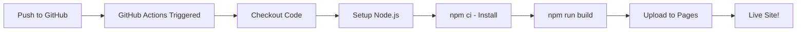

# 🚀 GitHub CI/CD Guide - Automated Deployment to GitHub Pages

This guide will teach you how to set up a complete CI/CD pipeline that automatically deploys your WebAR experience to GitHub Pages whenever you push code.

## 📋 Table of Contents
1. [Overview](#overview)
2. [Prerequisites](#prerequisites)
3. [Step-by-Step Setup](#step-by-step-setup)
4. [How the Pipeline Works](#how-the-pipeline-works)
5. [Troubleshooting](#troubleshooting)
6. [Advanced Configuration](#advanced-configuration)

---

## 🎯 Overview

### What is CI/CD?
**CI/CD** (Continuous Integration/Continuous Deployment) automatically:
- ✅ Tests your code when you push changes
- ✅ Builds your production app
- ✅ Deploys to GitHub Pages automatically
- ✅ Makes your WebAR experience live instantly

### What You'll Get:
```
Your Code Changes
      ↓
  git push
      ↓
GitHub Actions Triggered
      ↓
├─> Install Dependencies
├─> Build Production App
├─> Run Tests (if any)
└─> Deploy to GitHub Pages
      ↓
Live in ~2 minutes! 🎉
```

**Your app will be available at:**
`https://your-username.github.io/your-repo-name/`

---

## 📦 Prerequisites

Before starting, ensure you have:
- [ ] GitHub account
- [ ] Git installed locally
- [ ] Your WebAR project (this one!)
- [ ] Node.js 18+ installed

---

## 🚀 Step-by-Step Setup

### Step 1: Create a GitHub Repository

#### 1.1 Create New Repository on GitHub
1. Go to https://github.com/new
2. Repository name: `webxr-can-ar` (or your choice)
3. Description: "WebAR Can Experience"
4. Choose: **Public** (required for free GitHub Pages)
5. **DO NOT** initialize with README, .gitignore, or license
6. Click **"Create repository"**

#### 1.2 Note Your Repository Name
You'll need this for configuration. Example:
- Username: `johndoe`
- Repo name: `webxr-can-ar`
- Final URL: `https://johndoe.github.io/webxr-can-ar/`

---

### Step 2: Configure Your Project for GitHub Pages

#### 2.1 Update the Base Path

Open `vite.config.github.js` and set your repository name:

```bash
# Option 1: Set environment variable (recommended)
export VITE_REPO_NAME="webxr-can-ar"

# Option 2: Or edit vite.config.github.js directly
# Change: const repoName = process.env.VITE_REPO_NAME || '';
# To: const repoName = process.env.VITE_REPO_NAME || 'webxr-can-ar';
```

#### 2.2 Install Dependencies

```bash
cd /Users/callumcunningham/Downloads/AR
npm install
```

This will install the new `gh-pages` package needed for deployment.

---

### Step 3: Initialize Git and Push to GitHub

#### 3.1 Initialize Git Repository

```bash
# Make sure you're in your project directory
cd /Users/callumcunningham/Downloads/AR

# Initialize git
git init

# Add all files
git add .

# Create first commit
git commit -m "Initial commit: WebAR experience with CI/CD"
```

#### 3.2 Connect to GitHub

Replace `YOUR_USERNAME` and `YOUR_REPO` with your actual values:

```bash
# Add GitHub remote
git remote add origin https://github.com/YOUR_USERNAME/YOUR_REPO.git

# Verify remote
git remote -v

# Push to GitHub (main or master branch)
git branch -M main
git push -u origin main
```

**Example:**
```bash
git remote add origin https://github.com/johndoe/webxr-can-ar.git
git push -u origin main
```

---

### Step 4: Enable GitHub Pages

#### 4.1 Go to Repository Settings
1. Go to your repository on GitHub
2. Click **Settings** tab
3. Scroll down to **Pages** section (left sidebar)

#### 4.2 Configure Pages Source
1. Under "Build and deployment"
2. **Source**: Select **"GitHub Actions"**
3. That's it! No need to select a branch manually.


---

### Step 5: Enable GitHub Actions

#### 5.1 Check Workflow File
The workflow file is already created at:
`.github/workflows/deploy.yml`

#### 5.2 Set Repository Permissions
1. Go to **Settings** → **Actions** → **General**
2. Scroll to **Workflow permissions**
3. Select: **"Read and write permissions"**
4. Check: **"Allow GitHub Actions to create and approve pull requests"**
5. Click **Save**

---

### Step 6: Trigger Your First Deployment

#### 6.1 Make a Change
Edit any file (or just trigger the workflow):

```bash
# Option 1: Make a small change
echo "# WebAR Can Experience" >> README_TEMP.md

# Commit and push
git add .
git commit -m "Trigger first deployment"
git push
```

#### 6.2 Watch the Magic Happen!
1. Go to your repository on GitHub
2. Click the **Actions** tab
3. You'll see "Deploy WebAR to GitHub Pages" running
4. Click on it to watch real-time progress

**Expected workflow:**
```
✓ Checkout
✓ Setup Node.js
✓ Install dependencies
✓ Build with Vite
✓ Setup Pages
✓ Upload artifact
✓ Deploy to GitHub Pages
```

**Time:** ~1-2 minutes ⚡

#### 6.3 Access Your Live Site
Once the workflow completes:
1. Go to **Settings** → **Pages**
2. You'll see: **"Your site is live at https://username.github.io/repo-name/"**
3. Click the link to view your WebAR experience! 🎉

---

## 🔄 How the Pipeline Works

### Automatic Deployment Flow



### The Workflow File Explained

Let's break down `.github/workflows/deploy.yml`:

```yaml
name: Deploy WebAR to GitHub Pages

# When to run
on:
  push:
    branches: [main, master]  # Run on push to main/master
  workflow_dispatch:          # Allow manual trigger

# Permissions needed
permissions:
  contents: read   # Read repository
  pages: write     # Deploy to Pages
  id-token: write  # Authentication

# Jobs to run
jobs:
  build:
    runs-on: ubuntu-latest  # Use Ubuntu server
    
    steps:
      - name: Checkout
        uses: actions/checkout@v4  # Get your code
      
      - name: Setup Node.js
        uses: actions/setup-node@v4
        with:
          node-version: '20'       # Use Node 20
          cache: 'npm'             # Cache dependencies
      
      - name: Install dependencies
        run: npm ci                # Install packages
      
      - name: Build with Vite
        run: npm run build         # Build production app
        env:
          NODE_ENV: production
      
      - name: Upload artifact
        uses: actions/upload-pages-artifact@v3
        with:
          path: './dist'           # Upload build folder
  
  deploy:
    needs: build                   # Wait for build to finish
    runs-on: ubuntu-latest
    
    steps:
      - name: Deploy to GitHub Pages
        uses: actions/deploy-pages@v4  # Deploy!
```

### What Happens on Each Push:

1. **Trigger**: You push code to `main` or `master`
2. **Build Job**:
   - Checks out your code
   - Installs Node.js 20
   - Runs `npm ci` (clean install)
   - Builds production app with Vite
   - Uploads `dist/` folder as artifact
3. **Deploy Job**:
   - Takes the artifact from build
   - Deploys to GitHub Pages
   - Makes it live!

**Total Time:** ~1-2 minutes from push to live! ⚡

---

## 🔧 Configuration Options

### Option 1: Custom Domain (Optional)

If you have a custom domain:

1. **Add CNAME file:**
```bash
echo "your-domain.com" > public/CNAME
git add public/CNAME
git commit -m "Add custom domain"
git push
```

2. **Update vite.config.js:**
```javascript
base: '/',  // Root path for custom domain
```

3. **Configure DNS:**
- Add CNAME record pointing to `username.github.io`
- Wait for DNS propagation (~15 minutes)

### Option 2: Repository Name in Config

Instead of environment variable, hardcode it:

Edit `vite.config.github.js`:
```javascript
const repoName = 'your-repo-name';  // Hardcode here
```

### Option 3: Manual Trigger

You can manually trigger deployment:
1. Go to **Actions** tab
2. Click "Deploy WebAR to GitHub Pages"
3. Click **"Run workflow"**
4. Select branch and click **"Run workflow"**

---

## 📊 Monitoring Your Deployments

### View Deployment History
1. Go to **Actions** tab
2. See all past deployments
3. Click any to see logs
4. Green ✓ = Success
5. Red ✗ = Failed (check logs)

### Deployment Status Badge

Add to your README.md:
```markdown

```

This shows a badge: 

---

## 🐛 Troubleshooting

### Issue: Workflow Not Running

**Check:**
- [ ] Pushed to `main` or `master` branch?
- [ ] `.github/workflows/deploy.yml` exists?
- [ ] Actions enabled in Settings?

**Fix:**
```bash
# Verify branch name
git branch

# If on different branch, rename to main
git branch -M main
git push -u origin main
```

### Issue: Build Fails

**Common Causes:**
1. **Missing dependencies**
   - Check `package.json` is committed
   - Run `npm ci` locally first

2. **Build errors**
   - Test build locally: `npm run build`
   - Check logs in Actions tab

3. **Node version mismatch**
   - Workflow uses Node 20
   - Update if needed in `deploy.yml`

**Fix:**
```bash
# Test locally first
npm ci
npm run build

# If works locally, push again
git add .
git commit -m "Fix build issues"
git push
```

### Issue: Deployment Succeeds but Site Shows 404

**Cause:** Wrong base path configuration

**Fix:**
```bash
# Set your repository name
export VITE_REPO_NAME="your-repo-name"

# Rebuild
npm run build:github

# Update vite.config.github.js if needed
# Ensure: base: `/${repoName}/`

# Commit and push
git add .
git commit -m "Fix base path for GitHub Pages"
git push
```

### Issue: Assets Not Loading (Images/3D Models)

**Cause:** Incorrect asset paths

**Fix:**
Ensure paths in `index.html` are absolute:
```html
<!-- ✓ Good -->
<a-asset-item src="/doodles-can-2.glb"></a-asset-item>

<!-- ✗ Bad -->
<a-asset-item src="./doodles-can-2.glb"></a-asset-item>
```

### Issue: Camera Not Working on Live Site

**Check:**
- [ ] Site is HTTPS? (GitHub Pages is HTTPS by default ✓)
- [ ] Browser permissions allowed?
- [ ] Test on mobile device

**Debug:**
Open browser console and check for errors.

---

## 🚀 Advanced Configuration

### Add Build Optimization

Edit `.github/workflows/deploy.yml` to add optimization:

```yaml
- name: Build with Vite
  run: npm run build
  env:
    NODE_ENV: production
    VITE_REPO_NAME: ${{ github.event.repository.name }}  # Auto-detect repo
```

### Add Testing Before Deploy

```yaml
- name: Run tests
  run: npm test
  
- name: Build with Vite
  run: npm run build
```

### Deploy to Multiple Environments

Create separate workflows:
- `deploy-staging.yml` - Deploy to staging on PR
- `deploy-production.yml` - Deploy to production on main

### Add Slack/Discord Notifications

```yaml
- name: Notify on Success
  if: success()
  run: |
    curl -X POST -H 'Content-type: application/json' \
    --data '{"text":"🎉 WebAR deployed successfully!"}' \
    ${{ secrets.SLACK_WEBHOOK }}
```

---

## 📈 Performance Tips

### Optimize Build Speed

1. **Cache node_modules:**
   Already configured with `cache: 'npm'` ✓

2. **Use `npm ci` instead of `npm install`:**
   Already using it ✓

3. **Minimize dependencies:**
   Keep `package.json` lean

### Optimize Deployment

1. **Only deploy on main branch:**
   Already configured ✓

2. **Cancel redundant deploys:**
   `cancel-in-progress: false` prevents canceling active deploys

---

## ✅ Quick Reference

### Essential Commands

```bash
# Check workflow status
git log --oneline -1

# Force rebuild without code changes
git commit --allow-empty -m "Trigger rebuild"
git push

# View deployment URL
# Settings → Pages → Your site URL

# Manual deploy (alternative to GitHub Actions)
npm run deploy:github
```

### Important Files

| File | Purpose |
|------|---------|
| `.github/workflows/deploy.yml` | CI/CD pipeline definition |
| `vite.config.github.js` | GitHub Pages build config |
| `package.json` | Scripts and dependencies |
| `dist/` | Build output (don't commit!) |

### Useful Links

- Your repository: `https://github.com/USERNAME/REPO`
- Actions: `https://github.com/USERNAME/REPO/actions`
- Settings: `https://github.com/USERNAME/REPO/settings/pages`
- Live site: `https://USERNAME.github.io/REPO/`

---

## 🎓 Understanding the Workflow

### What is GitHub Actions?

GitHub Actions is a CI/CD platform that:
- Runs code on GitHub's servers
- Triggers on events (push, PR, schedule, manual)
- Uses YAML files to define workflows
- Provides free minutes for public repos

### What is GitHub Pages?

GitHub Pages is free hosting that:
- Serves static websites
- Automatically uses HTTPS
- Provides fast CDN
- Perfect for WebAR experiences!

### Why This Setup?

**Advantages:**
- ✅ **Free** - No hosting costs
- ✅ **Automatic** - Deploy on every push
- ✅ **Fast** - Live in ~2 minutes
- ✅ **Reliable** - GitHub's infrastructure
- ✅ **HTTPS** - Required for WebAR camera
- ✅ **Version Control** - Full history
- ✅ **Rollback** - Easy to revert

**vs Manual Deployment:**
- ❌ Manual: Build locally, FTP upload, error-prone
- ✅ Automatic: Push code, relax, it's live!

---

## 🎉 Success Checklist

Confirm everything works:
- [ ] Repository created on GitHub
- [ ] Code pushed to main/master branch
- [ ] GitHub Actions workflow runs successfully
- [ ] GitHub Pages enabled in Settings
- [ ] Site accessible at `https://username.github.io/repo-name/`
- [ ] Camera permissions work (HTTPS ✓)
- [ ] 3D model loads correctly
- [ ] AR marker detection works
- [ ] Mobile experience is smooth

---

## 🚀 You're Done!

**Congratulations! 🎊** You now have:
- ✅ Automated CI/CD pipeline
- ✅ GitHub Pages hosting
- ✅ Live WebAR experience
- ✅ Deploy on every push

### Your Workflow Now:
```bash
# 1. Make changes to your code
vim index.html

# 2. Commit changes
git add .
git commit -m "Update AR experience"

# 3. Push to GitHub
git push

# 4. Wait ~2 minutes ⏱️
# 5. Your changes are LIVE! 🎉
```

### Share Your WebAR:
```bash
# Your live URL
https://YOUR_USERNAME.github.io/YOUR_REPO/

# Generate QR code
npx qrcode-terminal https://YOUR_USERNAME.github.io/YOUR_REPO/

# Share QR code - anyone can scan and experience AR!
```

---

## 📚 Next Steps

1. **Test Your Pipeline:**
   - Make a small change
   - Push to GitHub
   - Watch Actions tab
   - Verify live site updates

2. **Add Your Content:**
   - Replace 3D model
   - Customize colors/styles
   - Add your branding

3. **Share:**
   - Generate QR code
   - Add to business cards
   - Share on social media
   - Add to your portfolio

---

**Questions?** Check the [main README](./README.md) or [DEPLOYMENT.md](./DEPLOYMENT.md)

**Happy Deploying! 🚀✨**

